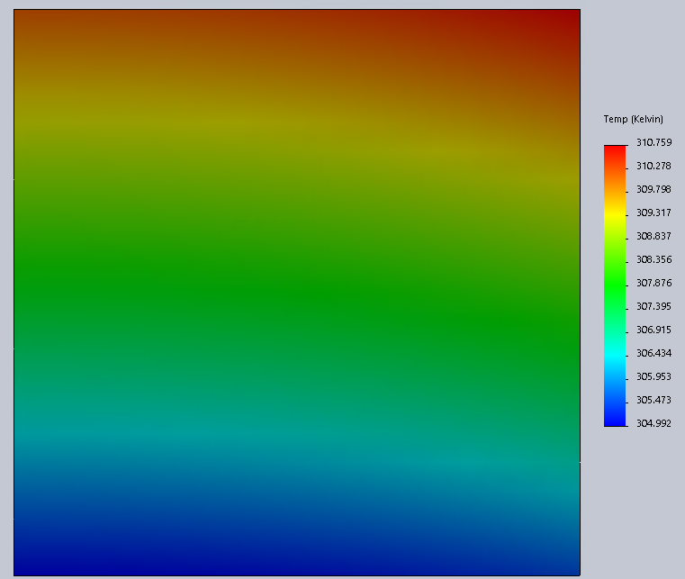

# thermal-finite-difference


Parallel 3D Steady-State Heat Equation Solver

**Note** This is a pretty old project from ~ 2020. I would do many things differently today, but its very nostalgic to look back on


## Usage

Current integration is fairly bare-bones and relies on editing `src/main.rs` and recompiling. There are 3 boundary conditions
that can be used:

1. Convection. 
    - requires
        - `T_infinity` `[K]`
        - `h` `[W/(m^2K)]`
2. Constant Temperature
    - requires
        - `temperature` `[K]`
3. Heat Flux
    - requires
        `heat_flux` `[W/m^2]`

Results can be plotted with `src/plot.py`


## Example

This example uses two temperature boundary conditions and four convective boundary conditions

```rust
fn main() {
    let h = 10.;
    let t_inf = 273. + 25.;
    let energy_generation = 0.;
    let thermal_conductivity = 43.;

    let top_boundary = Temperature { temperature: 350. };
    let bot_boundary = Temperature { temperature: 350. };

    let front_boundary = Convection { h, t_inf };
    let back_boundary = Convection { h, t_inf };

    let left_boundary = Convection { h, t_inf };
    let right_boundary = Convection { h, t_inf };

    let setup = setup::SetupConditions {
        right_boundary,
        left_boundary,
        top_boundary,
        bot_boundary,
        front_boundary,
        back_boundary,
    };

    let bcs = setup.make_boundaries();

    let params = SolverParams {
        len: 0.5,
        divisions: 100,
        error_epsilon: 0.0000001,
        data_steps: 50000,
        error_steps: 1000,
    };

    let div: T = params.divisions as f64;

    let solver_info = SolverInfo::builder()
        .k(thermal_conductivity)
        .q_dot(energy_generation)
        .del(params.len / div)
        .build();

    let error = error::L2Norm;

    let mut file = std::fs::File::create("results.json").unwrap();
    let result = solver::solver(solver_info, params, bcs, error);

    let save = dump::SaveFile {
        simulation: result,
        conditions: setup,
        solver_params: params,
    };

    serde_json::to_writer(&mut file, &save).unwrap();
}
```

Running and plotting

```
cargo r --release
python3 src/plot.py
```


## Results

These are a collection of comparisons between the results of this solver with equivalent Solidworks FEM

### Constant Temperature Top and Bottom with Convective Sides


### Constant Heat Flux Top and Bottom with Convective Sides


### Front and Top Heat Flux with Convective Sides





